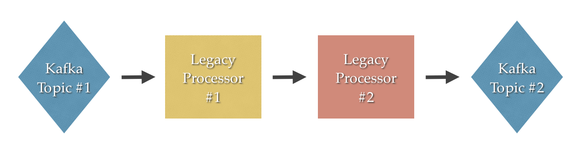

# Reactive Pipeline w/ Kafka, Akka Streams, RSocket

This is the repository for the talk "Retrofit your Java App with a Reactive Flow Pipeline" by [Mary Grygleski](https://twitter.com/mgrygles) and [Fabio Tiriticco](https://twitter.com/ticofab).

These projects implement the pipeline shown in the image below:

Data is ingested from a Kafka topic by a Scala application, processed and passed using [RSocket](http://rsocket.io) to the next application, written in Java. The purpose is to show some techiques to implement a pipeline that adheres to the Reactive Streams specification throughout the flow.

